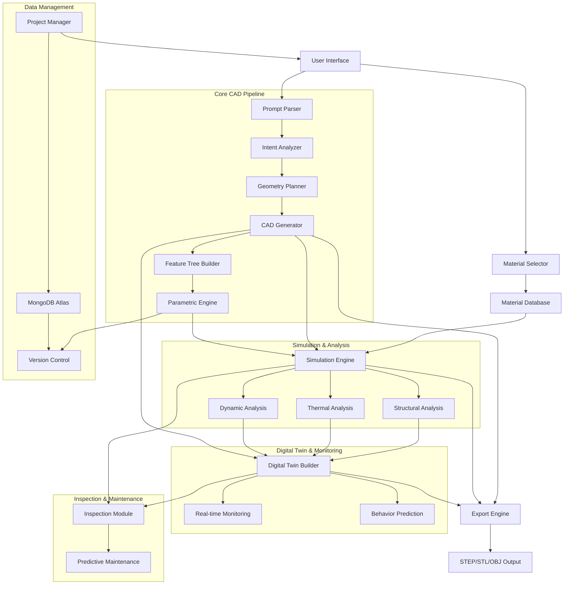

# Design Document: DigiForm

## Overview

DigiForm is an integrated AI-powered platform that transforms natural language into engineering-ready designs. The system addresses a critical barrier to innovation: the steep learning curve and fragmented toolchain required for mechanical design, simulation, and validation.

Traditional engineering workflows require mastery of multiple complex tools (CAD software, simulation packages, inspection tools) and months of training. This creates a significant barrier, especially for non-mechanical engineers with innovative ideas. DigiForm eliminates this barrier by providing a unified platform where users describe their design in natural language, select materials, and automatically receive:

- Parametric 3D CAD models
- Structural, thermal, and dynamic simulation results
- Digital twins for real-time monitoring
- Virtual inspection and quality assurance
- Predictive maintenance insights
- Manufacturing-ready export files

Based on recent research in text-to-CAD generation ([CADmium](https://arxiv.org/abs/2507.09792), [Query2CAD](https://www.aimodels.fyi/papers/arxiv/query2cad-generating-cad-models-using-natural-language), [LLM4CAD](https://www.researchgate.net/publication/385641538_LLM4CAD_Multi-Modal_Large_Language_Models_for_Three-Dimensional_Computer-Aided_Design_Generation)) and integrated with modern simulation and digital twin technologies, DigiForm represents a paradigm shift in engineering design accessibility.

## Architecture

The system follows an integrated architecture that combines natural language processing, CAD generation, material science, simulation, digital twin technology, and predictive analytics into a seamless workflow:



## Components and Interfaces

### Prompt Parser
**Purpose**: Processes natural language input and extracts structured design information including engineering requirements.

**Key Functions**:
- `parsePrompt(text: string): ParsedIntent` - Extracts geometric specifications, dimensions, constraints, and engineering requirements (loads, vibrations, temperatures)
- `identifyAmbiguities(intent: ParsedIntent): AmbiguityReport` - Detects unclear specifications
- `validateUnits(dimensions: Dimension[]): ValidationResult` - Ensures consistent unit usage
- `extractLoadConditions(text: string): LoadCondition[]` - Identifies applied loads and boundary conditions

**Implementation Approach**: Fine-tuned transformer model (based on code-LLM architecture like CodeT5) trained on engineering text and CAD operation sequences. The model converts natural language to a structured JSON representation containing geometric primitives, dimensions, relationships, and engineering requirements.

### Material Selector & Database
**Purpose**: Provides comprehensive material properties for design and simulation.

**Key Functions**:
- `getMaterialProperties(materialName: string): MaterialProperties` - Retrieves complete material data
- `compareMaterials(materials: string[]): ComparisonMatrix` - Compares multiple materials
- `suggestMaterial(requirements: DesignRequirements): MaterialRecommendation[]` - Recommends materials based on requirements
- `addCustomMaterial(properties: MaterialProperties): void` - Adds user-defined materials

**Material Properties**:
```typescript
interface MaterialProperties {
  name: string;
  density: number; // kg/m³
  youngsModulus: number; // GPa
  poissonsRatio: number;
  yieldStrength: number; // MPa
  ultimateStrength: number; // MPa
  thermalConductivity: number; // W/(m·K)
  specificHeat: number; // J/(kg·K)
  thermalExpansion: number; // 1/K
  cost: number; // $/kg
  manufacturability: ManufacturabilityRating;
}
```

**Supported Materials**: Aluminum (6061-T6, 7075-T6), Steel (Mild, Stainless 304/316), Brass (C36000), Plastic (ABS, PLA, Nylon, PETG)

### Intent Analyzer
**Purpose**: Interprets parsed prompts to understand design intent and engineering requirements.

**Key Functions**:
- `analyzeDesignIntent(parsed: ParsedIntent): DesignIntent` - Determines primary design goals
- `extractConstraints(parsed: ParsedIntent): Constraint[]` - Identifies geometric and functional constraints
- `inferMissingDetails(intent: DesignIntent): CompletedIntent` - Fills gaps using engineering heuristics

**Data Structures**:
```typescript
interface DesignIntent {
  primaryFunction: string;
  geometricPrimitives: GeometricPrimitive[];
  dimensions: Dimension[];
  constraints: Constraint[];
  materialRequirements?: MaterialSpec;
  manufacturingConstraints?: ManufacturingConstraint[];
}
```

### Geometry Planner
**Purpose**: Plans the sequence of CAD operations needed to create the desired geometry.

**Key Functions**:
- `planOperationSequence(intent: DesignIntent): OperationPlan` - Creates ordered list of CAD operations
- `optimizeSequence(plan: OperationPlan): OperationPlan` - Optimizes for efficiency and editability
- `validatePlan(plan: OperationPlan): PlanValidation` - Checks for geometric feasibility

**Operation Types**: Sketch creation, extrusion, revolution, sweep, boolean operations (union, difference, intersection), fillets, chamfers, patterns (linear, circular).

### Model Generator
**Purpose**: Executes the planned CAD operations to create 3D geometry with applied material properties.

**Key Functions**:
- `executeOperationPlan(plan: OperationPlan, material: MaterialProperties): CADModel` - Generates 3D geometry with material
- `createSketch(profile: SketchProfile, plane: Plane): Sketch` - Creates 2D sketches
- `performExtrusion(sketch: Sketch, params: ExtrusionParams): Solid` - Creates 3D features
- `applyMaterial(model: CADModel, material: MaterialProperties): void` - Applies material properties to model

**Geometric Engine**: Built on OpenCASCADE Technology (OCCT) for robust geometric operations and STEP/IGES compatibility. OCCT provides industrial-grade geometric modeling capabilities used in professional CAD systems.

### Simulation Engine
**Purpose**: Performs structural, thermal, and dynamic analysis on generated models.

**Key Functions**:
- `runStructuralAnalysis(model: CADModel, loads: LoadCondition[], constraints: BoundaryCondition[]): StructuralResults` - Computes stress, strain, deformation
- `runThermalAnalysis(model: CADModel, heatSources: HeatSource[], ambientTemp: number): ThermalResults` - Computes temperature distribution
- `runDynamicAnalysis(model: CADModel, excitation: Excitation): DynamicResults` - Computes natural frequencies and vibration response
- `computeSafetyFactor(results: StructuralResults, material: MaterialProperties): number` - Calculates safety factors

**Analysis Types**:
```typescript
interface StructuralResults {
  maxStress: number; // MPa
  maxStrain: number;
  maxDeformation: number; // mm
  stressDistribution: StressField;
  criticalPoints: CriticalPoint[];
  safetyFactor: number;
}

interface ThermalResults {
  maxTemperature: number; // °C
  minTemperature: number;
  temperatureDistribution: TemperatureField;
  heatFlux: HeatFluxField;
}

interface DynamicResults {
  naturalFrequencies: number[]; // Hz
  modeShapes: ModeShape[];
  vibrationResponse: VibrationField;
  resonanceRisks: ResonanceWarning[];
}
```

**Solver Implementation**: Finite Element Analysis (FEA) using tetrahedral mesh generation and iterative solvers (Conjugate Gradient, GMRES) for large systems.

### Feature Tree Builder
**Purpose**: Constructs hierarchical feature trees that represent the modeling process.

**Key Functions**:
- `buildFeatureTree(operations: Operation[]): FeatureTree` - Creates hierarchical structure
- `establishDependencies(tree: FeatureTree): DependencyGraph` - Maps feature relationships
- `validateTreeIntegrity(tree: FeatureTree): ValidationResult` - Ensures valid dependencies

**Tree Structure**:
```typescript
interface FeatureNode {
  id: string;
  type: FeatureType;
  parameters: ParameterSet;
  children: FeatureNode[];
  dependencies: string[];
  sketch?: Sketch;
}
```

### Parametric Engine
**Purpose**: Manages parametric relationships and constraint solving.

**Key Functions**:
- `createParameters(dimensions: Dimension[]): Parameter[]` - Defines parametric variables
- `establishConstraints(constraints: Constraint[]): ConstraintSystem` - Sets up constraint relationships
- `solveConstraints(system: ConstraintSystem): SolutionResult` - Resolves parametric values
- `updateModel(changes: ParameterChange[]): UpdateResult` - Propagates parameter changes

**Constraint Solver**: Implements geometric constraint solving using numerical methods (Newton-Raphson) for 2D sketches and dependency propagation for 3D features.

### Version Control System
**Purpose**: Manages model versions and enables design iteration tracking.

**Key Functions**:
- `createVersion(model: CADModel, description: string): Version` - Creates new version snapshot
- `compareVersions(v1: Version, v2: Version): VersionDiff` - Compares two versions
- `restoreVersion(versionId: string): CADModel` - Restores previous version
- `getVersionHistory(projectId: string): Version[]` - Retrieves complete version history

**Version Data**:
```typescript
interface Version {
  id: string;
  timestamp: Date;
  description: string;
  model: CADModel;
  parameters: Parameter[];
  simulationResults?: SimulationResults;
  author: string;
  changeLog: Change[];
}
```

### Digital Twin Builder
**Purpose**: Creates and manages digital twins for real-time monitoring and prediction.

**Key Functions**:
- `createDigitalTwin(model: CADModel, simResults: SimulationResults): DigitalTwin` - Generates digital twin
- `updateTwinState(twin: DigitalTwin, sensorData: SensorData): void` - Updates with real-time data
- `predictBehavior(twin: DigitalTwin, scenario: Scenario): PredictionResult` - Predicts performance
- `detectAnomalies(twin: DigitalTwin): Anomaly[]` - Identifies abnormal behavior

**Digital Twin Structure**:
```typescript
interface DigitalTwin {
  id: string;
  physicalComponentId?: string;
  geometricModel: CADModel;
  materialProperties: MaterialProperties;
  simulationBaseline: SimulationResults;
  currentState: ComponentState;
  historicalData: TimeSeriesData[];
  predictiveModels: MLModel[];
  alerts: Alert[];
}

interface ComponentState {
  timestamp: Date;
  temperature: number;
  stress: number;
  vibration: number;
  wear: number;
  health: number; // 0-100%
}
```

### Inspection Module
**Purpose**: Performs virtual inspection and quality assurance.

**Key Functions**:
- `inspectDimensions(model: CADModel, tolerances: Tolerance[]): InspectionReport` - Verifies dimensional accuracy
- `checkGeometricTolerances(model: CADModel, gdt: GDT[]): GDTReport` - Validates GD&T specifications
- `detectDefects(model: CADModel): Defect[]` - Identifies potential manufacturing defects
- `compareToSpecification(model: CADModel, spec: Specification): ComplianceReport` - Compares against requirements

**Inspection Capabilities**:
- Dimensional verification (length, diameter, angle measurements)
- Geometric Dimensioning and Tolerancing (GD&T) validation
- Surface finish analysis
- Assembly interference checking
- Manufacturing feasibility assessment

### Predictive Maintenance System
**Purpose**: Analyzes failure modes and predicts component lifecycle.

**Key Functions**:
- `analyzeFatigue(simResults: StructuralResults, loadHistory: LoadHistory): FatigueAnalysis` - Predicts fatigue life
- `predictWear(twin: DigitalTwin, operatingConditions: OperatingConditions): WearPrediction` - Estimates wear patterns
- `estimateServiceLife(component: Component, usage: UsageProfile): ServiceLifeEstimate` - Calculates expected lifespan
- `generateMaintenanceSchedule(predictions: Prediction[]): MaintenanceSchedule` - Creates maintenance plan

**Predictive Models**:
```typescript
interface FatigueAnalysis {
  cyclesTo Failure: number;
  criticalLocations: Point3D[];
  stressConcentrationFactors: number[];
  fatigueLife: number; // hours
  confidenceInterval: [number, number];
}

interface WearPrediction {
  wearRate: number; // mm/year
  wearLocations: WearZone[];
  estimatedReplacement: Date;
  maintenanceRecommendations: string[];
}

interface ServiceLifeEstimate {
  expectedLife: number; // hours
  failureModes: FailureMode[];
  maintenanceIntervals: MaintenanceInterval[];
  costAnalysis: CostBreakdown;
}
```

**Analysis Methods**:
- S-N curve fatigue analysis
- Miner's rule for cumulative damage
- Wear coefficient models (Archard equation)
- Stress concentration factor analysis
- Thermal cycling effects
- Corrosion rate estimation

### Validation Engine
**Purpose**: Validates generated models for geometric consistency, manufacturability, and engineering requirements.

**Key Functions**:
- `validateGeometry(model: CADModel): GeometryValidation` - Checks for geometric errors
- `checkManufacturability(model: CADModel): ManufacturingAnalysis` - Analyzes manufacturing feasibility
- `detectInterferences(model: CADModel): InterferenceReport` - Identifies geometric conflicts
- `validateSimulationResults(results: SimulationResults, requirements: Requirements): ValidationReport` - Verifies design meets requirements

**Validation Criteria**: Closed volumes, manifold geometry, minimum feature sizes, draft angles, undercuts, material thickness requirements, stress limits, temperature limits, and vibration tolerances.

### Export Engine
**Purpose**: Exports models, simulation results, and digital twins to standard formats.

**Key Functions**:
- `exportSTEP(model: CADModel): STEPFile` - Exports to STEP format (ISO 10303-21)
- `exportSTL(model: CADModel): STLFile` - Exports triangulated mesh for 3D printing
- `exportOBJ(model: CADModel): OBJFile` - Exports to OBJ format for 3D visualization
- `exportParametric(model: CADModel, format: ParametricFormat): ParametricFile` - Exports with parameters
- `exportSimulationReport(results: SimulationResults): PDFReport` - Generates simulation report
- `exportDigitalTwinPackage(twin: DigitalTwin): TwinPackage` - Exports complete digital twin data

**Format Support**: 
- STEP (ISO 10303-21) - Universal CAD format with parametric support
- STL - Triangulated mesh for 3D printing and rapid prototyping
- OBJ - 3D model format for visualization and rendering
- Native formats for SolidWorks, Fusion 360, AutoCAD (where APIs available)
- PDF reports for simulation results and inspection data
- JSON for digital twin data exchange

## Data Models

### Core Data Structures

```typescript
// Geometric primitives
interface Point3D {
  x: number;
  y: number;
  z: number;
}

interface Vector3D {
  x: number;
  y: number;
  z: number;
}

interface Plane {
  origin: Point3D;
  normal: Vector3D;
  xAxis: Vector3D;
}

// CAD-specific structures
interface Sketch {
  id: string;
  plane: Plane;
  curves: Curve[];
  constraints: SketchConstraint[];
  dimensions: SketchDimension[];
}

interface Curve {
  type: 'line' | 'arc' | 'circle' | 'spline';
  points: Point3D[];
  parameters: CurveParameters;
}

interface CADModel {
  id: string;
  featureTree: FeatureTree;
  geometry: Solid[];
  parameters: Parameter[];
  constraints: Constraint[];
  material: MaterialProperties;
  metadata: ModelMetadata;
}

// Parametric system
interface Parameter {
  name: string;
  value: number;
  unit: string;
  range?: [number, number];
  expression?: string;
}

interface Constraint {
  type: ConstraintType;
  entities: string[];
  value?: number;
  expression?: string;
}
```

### Simulation Data Models

```typescript
interface SimulationResults {
  structural?: StructuralResults;
  thermal?: ThermalResults;
  dynamic?: DynamicResults;
  timestamp: Date;
  convergence: ConvergenceInfo;
}

interface LoadCondition {
  type: 'force' | 'pressure' | 'moment';
  magnitude: number;
  direction: Vector3D;
  location: Point3D | Surface;
}

interface BoundaryCondition {
  type: 'fixed' | 'pinned' | 'roller' | 'symmetry';
  location: Surface | Edge | Point3D;
  constraints: DOFConstraint[];
}
```

### Digital Twin Data Models

```typescript
interface DigitalTwinData {
  twin: DigitalTwin;
  sensorMappings: SensorMapping[];
  updateFrequency: number; // Hz
  alertThresholds: AlertThreshold[];
}

interface SensorData {
  sensorId: string;
  timestamp: Date;
  measurements: Measurement[];
}

interface Measurement {
  type: 'temperature' | 'stress' | 'vibration' | 'displacement';
  value: number;
  unit: string;
  location: Point3D;
}
```

### Inspection & Maintenance Data Models

```typescript
interface InspectionReport {
  timestamp: Date;
  dimensionalChecks: DimensionalCheck[];
  gdtChecks: GDTCheck[];
  defects: Defect[];
  overallStatus: 'pass' | 'fail' | 'warning';
}

interface MaintenanceSchedule {
  componentId: string;
  inspections: ScheduledInspection[];
  replacements: ScheduledReplacement[];
  estimatedCost: number;
}
```

### Project Data Model

```typescript
interface Project {
  id: string;
  name: string;
  description: string;
  originalPrompt: string;
  model: CADModel;
  material: MaterialProperties;
  simulationResults: SimulationResults[];
  digitalTwin?: DigitalTwin;
  inspectionReports: InspectionReport[];
  maintenanceSchedule?: MaintenanceSchedule;
  versions: ProjectVersion[];
  createdAt: Date;
  updatedAt: Date;
  author: string;
  tags: string[];
}

interface ProjectVersion {
  id: string;
  prompt: string;
  model: CADModel;
  simulationResults?: SimulationResults;
  timestamp: Date;
  changes: ChangeLog[];
  author: string;
}
```

## Error Handling

The system implements comprehensive error handling across all components:

**Prompt Processing Errors**:
- Ambiguous specifications → Request clarification with specific questions
- Impossible geometries → Suggest feasible alternatives with explanations
- Unit inconsistencies → Auto-convert or request clarification
- Missing load conditions → Request engineering requirements

**Geometric Errors**:
- Invalid sketches → Highlight problematic constraints and suggest fixes
- Failed operations → Provide alternative operation sequences
- Constraint conflicts → Identify conflicting constraints and resolution options

**Simulation Errors**:
- Non-convergence → Suggest mesh refinement or solver parameter adjustments
- Invalid boundary conditions → Identify conflicts and suggest corrections
- Material property errors → Validate material selection and properties
- Excessive deformation → Warn about potential design failure

**Digital Twin Errors**:
- Sensor data anomalies → Flag suspicious readings for verification
- Communication failures → Implement retry logic and offline buffering
- Prediction model drift → Trigger model retraining alerts

**Export Errors**:
- Format limitations → Warn about lost information and suggest alternatives
- File system errors → Provide clear error messages and retry mechanisms

**Recovery Strategies**:
- Automatic fallback to simpler geometries when complex operations fail
- Incremental validation to catch errors early in the process
- User-friendly error messages with suggested corrections

## Testing Strategy

The testing approach combines unit testing for individual components with property-based testing for geometric correctness, simulation accuracy, and system integration.

**Unit Testing Focus**:
- Component interfaces and data transformations
- Material database queries and property retrieval
- CAD operation execution and feature tree construction
- Simulation solver convergence and accuracy
- Digital twin state updates and predictions
- Inspection algorithms and defect detection
- Error handling and edge cases
- File format compatibility and export/import
- User interface interactions and workflows

**Property-Based Testing Focus**:
- Geometric validity properties across all generated models
- Parametric consistency under parameter changes
- Material property application and simulation accuracy
- Simulation result consistency across mesh refinements
- Digital twin prediction accuracy against known scenarios
- Round-trip testing for file format preservation
- Constraint satisfaction across all valid inputs
- Version control integrity and rollback correctness

**Integration Testing**:
- End-to-end workflow from prompt to export
- CAD generation → Simulation → Digital Twin pipeline
- Multi-material model handling
- Concurrent user operations and data consistency
- Real-time digital twin updates with sensor data

**Testing Configuration**:
- Property tests run with minimum 100 iterations using appropriate PBT library
- Each test tagged with format: **Feature: digiform, Property {number}: {property_text}**
- Geometric validation using computational geometry libraries
- Simulation validation against analytical solutions and benchmark problems
- Performance testing for model generation, simulation, and digital twin update times
- Load testing for concurrent users and large models

## Correctness Properties

*A property is a characteristic or behavior that should hold true across all valid executions of a system—essentially, a formal statement about what the system should do. Properties serve as the bridge between human-readable specifications and machine-verifiable correctness guarantees.*

Based on the prework analysis and property reflection to eliminate redundancy, the following properties validate the core correctness requirements of DigiForm. These properties cover CAD generation, material application, simulation accuracy, digital twin functionality, inspection, and predictive maintenance.

### Property 1: Prompt Parsing Completeness
*For any* natural language prompt containing geometric specifications, the Prompt_Parser should extract all geometric specifications, dimensions, and design intent without loss of critical information.
**Validates: Requirements 1.1**

### Property 2: Ambiguity Detection
*For any* prompt containing ambiguous or unclear specifications, the Prompt_Parser should identify and flag all ambiguous elements for clarification.
**Validates: Requirements 1.2**

### Property 3: Engineering Terminology Interpretation
*For any* prompt using standard engineering terminology and units, the Prompt_Parser should correctly interpret all terms and convert units consistently.
**Validates: Requirements 1.3**

### Property 4: Constraint Extraction and Validation
*For any* prompt specifying design constraints, the Prompt_Parser should capture all constraint relationships and validate their consistency.
**Validates: Requirements 1.4**

### Property 5: Complete Model Generation
*For any* valid geometric specification, the Model_Generator should create a complete 3D parametric model that accurately represents the specified geometry.
**Validates: Requirements 2.1**

### Property 6: Parameter Creation from Dimensions
*For any* specified dimensions in prompts or sketches, the system should create corresponding editable parameters that control the model geometry.
**Validates: Requirements 2.2, 4.2**

### Property 7: Constraint Implementation
*For any* described geometric relationships in prompts or sketches, the system should implement them as parametric constraints that maintain the relationships.
**Validates: Requirements 2.3, 4.3**

### Property 8: Geometric Validity Preservation
*For any* parametric model and any valid parameter changes, the model should maintain geometric validity and manufacturability.
**Validates: Requirements 2.4**

### Property 9: Manufacturable Feature Decomposition
*For any* complex geometry request, the Model_Generator should decompose it into a set of manufacturable features that can be produced using standard manufacturing processes.
**Validates: Requirements 2.5**

### Property 10: Feature Tree Completeness
*For any* generated model, the system should create a hierarchical feature tree that includes all operations and maintains proper parent-child relationships.
**Validates: Requirements 3.1, 3.2**

### Property 11: Automatic Feature Updates
*For any* feature modification in models or sketches, all dependent features should update automatically to maintain design consistency.
**Validates: Requirements 3.3, 4.5**

### Property 12: Standard CAD Operations Coverage
*For any* generated feature tree, it should include all necessary standard CAD operations (sketches, extrusions, cuts, fillets, etc.) to represent the design.
**Validates: Requirements 3.4**

### Property 13: Feature Tree Integrity Under Reordering
*For any* valid feature reordering operation, the feature tree should maintain model integrity and geometric validity.
**Validates: Requirements 3.5**

### Property 14: Fully Constrained Sketch Generation
*For any* 2D profile needed for 3D features, the system should generate fully constrained sketches on appropriate reference planes.
**Validates: Requirements 4.1, 4.4**

### Property 15: Universal CAD Format Export
*For any* generated model, the CAD_Exporter should successfully export to STEP and STL formats while preserving geometric accuracy.
**Validates: Requirements 5.1, 5.2**

### Property 16: Parametric Information Preservation
*For any* parametric model export to formats supporting parameters, the parameter definitions and feature hierarchy should be preserved where possible.
**Validates: Requirements 5.4, 5.5**

### Property 17: Design Analysis and Suggestions
*For any* generated model, the Design_Assistant should analyze manufacturability and provide relevant suggestions when improvements are possible.
**Validates: Requirements 6.1, 6.2, 6.3, 6.4**

### Property 18: Comprehensive Model Validation
*For any* model generation or modification, the system should validate geometric consistency, detect impossible geometries, and check manufacturing constraints.
**Validates: Requirements 7.1, 7.2, 7.3**

### Property 19: Error Handling and Recovery
*For any* model generation failure, the system should provide clear error messages and actionable recovery suggestions.
**Validates: Requirements 7.4**

### Property 20: Real-time Validation
*For any* interactive model editing operation, the system should perform validation and provide immediate feedback.
**Validates: Requirements 7.5**

### Property 21: Feature Tree Display
*For any* generated model, the system should display the feature tree in a hierarchical view that accurately represents the modeling operations.
**Validates: Requirements 8.3**

### Property 22: Real-time Preview Updates
*For any* parameter modification, the system should provide real-time preview updates that accurately reflect the changes.
**Validates: Requirements 8.4**

### Property 23: Performance Requirements
*For any* model generation request, simple models should complete within 10 seconds and complex models within 60 seconds.
**Validates: Requirements 9.1, 9.2**

### Property 24: Scalability with Feature Count
*For any* model with up to 100 parametric features, the system should maintain acceptable performance without degradation.
**Validates: Requirements 9.3**

### Property 25: Progress Indication
*For any* long-running operation, the system should provide progress indicators that accurately reflect completion status.
**Validates: Requirements 9.5**

### Property 26: Complete Data Persistence
*For any* project data including prompts, models, and parameters, the system should save all information required for complete restoration.
**Validates: Requirements 10.1**

### Property 27: Project Data Round-trip Consistency
*For any* saved project, loading the project should restore the complete design state including feature trees, parameters, and model geometry.
**Validates: Requirements 10.2, 10.4**

### Property 28: Project Versioning
*For any* project modifications, the system should create and track versions that allow navigation through design evolution.
**Validates: Requirements 10.3**

### Property 29: Project Management Features
*For any* project collection, the system should provide search, organization, and sharing capabilities that enable efficient project management.
**Validates: Requirements 10.5**


### Property 30: Material Property Application
*For any* selected material, the system should correctly apply all material properties (density, Young's modulus, yield strength, thermal conductivity, etc.) to the CAD model for accurate simulation.
**Validates: Requirements 1.6, 2.4**

### Property 31: Structural Simulation Accuracy
*For any* CAD model with applied loads and boundary conditions, the Simulation_Engine should compute stress, strain, and deformation results that converge to accurate solutions within acceptable tolerances.
**Validates: Requirements 4.1, 4.2**

### Property 32: Thermal Simulation Accuracy
*For any* CAD model with heat sources and thermal boundary conditions, the Simulation_Engine should compute temperature distribution and heat flux that satisfy energy conservation principles.
**Validates: Requirements 4.3**

### Property 33: Dynamic Simulation Accuracy
*For any* CAD model, the Simulation_Engine should compute natural frequencies and mode shapes that satisfy the eigenvalue problem for structural dynamics.
**Validates: Requirements 4.4**

### Property 34: Safety Factor Calculation
*For any* structural simulation results, the system should correctly calculate safety factors by comparing maximum stress to material yield strength.
**Validates: Requirements 4.7**

### Property 35: Digital Twin Generation Completeness
*For any* finalized CAD model with simulation results, the Digital_Twin Builder should generate a complete digital twin including geometric model, material properties, and baseline simulation data.
**Validates: Requirements 5.1, 5.2**

### Property 36: Digital Twin State Updates
*For any* digital twin receiving sensor data, the system should update the twin's current state to reflect real-time measurements within specified latency limits.
**Validates: Requirements 5.3**

### Property 37: Behavior Prediction Consistency
*For any* digital twin and operational scenario, the system should provide behavior predictions that are consistent with the underlying physics models and simulation results.
**Validates: Requirements 5.6**

### Property 38: Anomaly Detection Sensitivity
*For any* digital twin with established baseline behavior, the system should detect anomalies when measurements deviate beyond configured thresholds.
**Validates: Requirements 5.5**

### Property 39: Dimensional Inspection Accuracy
*For any* generated CAD model, the Inspection_Module should accurately verify all dimensions against specified tolerances.
**Validates: Requirements 6.1, 6.2**

### Property 40: Failure Point Detection
*For any* simulation results showing stress concentrations, the Inspection_Module should correctly identify potential failure points where stress exceeds material limits.
**Validates: Requirements 6.3**

### Property 41: Fatigue Life Prediction
*For any* component under cyclic loading, the Predictive_Maintenance system should estimate fatigue life using appropriate fatigue analysis methods (S-N curves, Miner's rule).
**Validates: Requirements 6.4, 6.5**

### Property 42: Service Life Estimation
*For any* component with defined operating conditions, the Predictive_Maintenance system should provide service life estimates based on wear, fatigue, and degradation models.
**Validates: Requirements 6.5**

### Property 43: Maintenance Schedule Generation
*For any* set of failure predictions, the Predictive_Maintenance system should generate maintenance schedules with appropriate inspection and replacement intervals.
**Validates: Requirements 6.6**

### Property 44: Real-time Preview Updates
*For any* parameter modification in the CAD model, the system should update the 3D preview in real-time to reflect the changes.
**Validates: Requirements 7.2**

### Property 45: Multi-Format Export Completeness
*For any* generated model, the Export_Engine should successfully export to STEP, STL, and OBJ formats while preserving geometric accuracy.
**Validates: Requirements 7.4, 7.5, 7.6**

### Property 46: Simulation Report Generation
*For any* completed simulation, the Export_Engine should generate comprehensive reports including numerical results, visualizations, and safety factors.
**Validates: Requirements 7.9**

### Property 47: Version Control Integrity
*For any* model modification, the Version Control System should create accurate version snapshots that can be restored to reproduce the exact model state.
**Validates: Requirements 3.4, 3.5, 3.6**

### Property 48: Version Comparison Accuracy
*For any* two versions of a model, the system should accurately identify and highlight all differences in geometry, parameters, and simulation results.
**Validates: Requirements 3.7**

### Property 49: Material Database Completeness
*For any* supported material (Aluminum, Steel, Brass, Plastic), the Material_Database should provide all required properties for CAD modeling and simulation.
**Validates: Requirements 11.1, 11.2**

### Property 50: Material Comparison Functionality
*For any* set of materials, the Material_Database should provide comparison tools that help users select appropriate materials based on design requirements.
**Validates: Requirements 11.5**

### Property 51: Simulation Performance
*For any* simple model, structural simulation should complete within 30 seconds, and for complex models within 60 seconds.
**Validates: Requirements 9.3, 9.4**

### Property 52: Digital Twin Update Latency
*For any* digital twin receiving sensor data, state updates should complete with latency under 5 seconds.
**Validates: Requirements 9.8**

### Property 53: Integrated Workflow Continuity
*For any* engineering workflow (design → simulate → inspect → maintain), the system should maintain data continuity without requiring external tool integration.
**Validates: Requirements 8.1**

### Property 54: Project Data Persistence Completeness
*For any* project save operation, the system should persist all data including CAD models, materials, simulation results, digital twins, inspection reports, and maintenance schedules.
**Validates: Requirements 10.1, 10.2**

### Property 55: Cloud Synchronization Consistency
*For any* project accessed from multiple devices, the system should maintain data consistency through cloud synchronization.
**Validates: Requirements 10.10**

### Property 56: Validation Error Messaging
*For any* validation failure (geometric, simulation, or inspection), the system should provide clear error messages with actionable recovery suggestions.
**Validates: Requirements 12.4, 12.5**

### Property 57: Simulation Convergence Handling
*For any* simulation that fails to converge, the system should provide diagnostic information and suggest corrective actions (mesh refinement, solver adjustments).
**Validates: Requirements 12.6**
