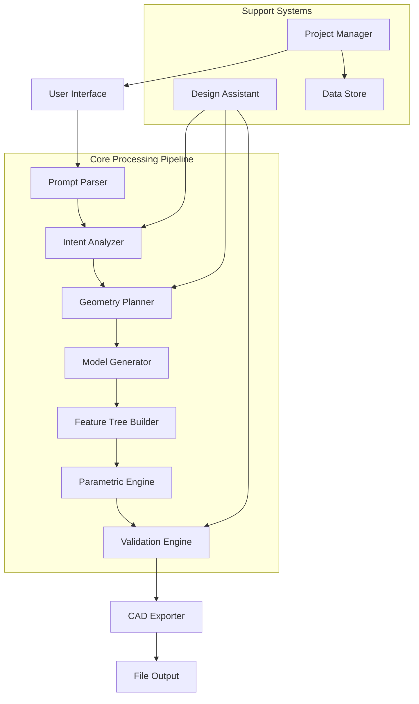

# Design Document: CADify

## Overview

CADify is an AI-powered Prompt-to-CAD application that transforms natural language descriptions into parametric 3D CAD models. The system leverages modern large language models (LLMs) and geometric processing libraries to understand engineering intent and generate manufacturable designs with proper feature trees and parametric constraints.

Based on recent research in text-to-CAD generation ([CADmium](https://arxiv.org/abs/2507.09792), [Query2CAD](https://www.aimodels.fyi/papers/arxiv/query2cad-generating-cad-models-using-natural-language), [LLM4CAD](https://www.researchgate.net/publication/385641538_LLM4CAD_Multi-Modal_Large_Language_Models_for_Three-Dimensional_Computer-Aided_Design_Generation)), the system adopts a sequential approach where CAD operations are represented as structured sequences that can be generated by fine-tuned language models.

## Architecture

The system follows a modular architecture with clear separation between natural language processing, geometric generation, and CAD export functionality:



## Components and Interfaces

### Prompt Parser
**Purpose**: Processes natural language input and extracts structured design information.

**Key Functions**:
- `parsePrompt(text: string): ParsedIntent` - Extracts geometric specifications, dimensions, and constraints
- `identifyAmbiguities(intent: ParsedIntent): AmbiguityReport` - Detects unclear specifications
- `validateUnits(dimensions: Dimension[]): ValidationResult` - Ensures consistent unit usage

**Implementation Approach**: Fine-tuned transformer model (based on code-LLM architecture like CodeT5) trained on engineering text and CAD operation sequences. The model converts natural language to a structured JSON representation containing geometric primitives, dimensions, and relationships.

### Intent Analyzer
**Purpose**: Interprets parsed prompts to understand design intent and engineering requirements.

**Key Functions**:
- `analyzeDesignIntent(parsed: ParsedIntent): DesignIntent` - Determines primary design goals
- `extractConstraints(parsed: ParsedIntent): Constraint[]` - Identifies geometric and functional constraints
- `inferMissingDetails(intent: DesignIntent): CompletedIntent` - Fills gaps using engineering heuristics

**Data Structures**:
```typescript
interface DesignIntent {
  primaryFunction: string;
  geometricPrimitives: GeometricPrimitive[];
  dimensions: Dimension[];
  constraints: Constraint[];
  materialRequirements?: MaterialSpec;
  manufacturingConstraints?: ManufacturingConstraint[];
}
```

### Geometry Planner
**Purpose**: Plans the sequence of CAD operations needed to create the desired geometry.

**Key Functions**:
- `planOperationSequence(intent: DesignIntent): OperationPlan` - Creates ordered list of CAD operations
- `optimizeSequence(plan: OperationPlan): OperationPlan` - Optimizes for efficiency and editability
- `validatePlan(plan: OperationPlan): PlanValidation` - Checks for geometric feasibility

**Operation Types**: Sketch creation, extrusion, revolution, sweep, boolean operations (union, difference, intersection), fillets, chamfers, patterns (linear, circular).

### Model Generator
**Purpose**: Executes the planned CAD operations to create 3D geometry.

**Key Functions**:
- `executeOperationPlan(plan: OperationPlan): CADModel` - Generates 3D geometry
- `createSketch(profile: SketchProfile, plane: Plane): Sketch` - Creates 2D sketches
- `performExtrusion(sketch: Sketch, params: ExtrusionParams): Solid` - Creates 3D features

**Geometric Engine**: Built on OpenCASCADE Technology (OCCT) for robust geometric operations and STEP/IGES compatibility. OCCT provides industrial-grade geometric modeling capabilities used in professional CAD systems.

### Feature Tree Builder
**Purpose**: Constructs hierarchical feature trees that represent the modeling process.

**Key Functions**:
- `buildFeatureTree(operations: Operation[]): FeatureTree` - Creates hierarchical structure
- `establishDependencies(tree: FeatureTree): DependencyGraph` - Maps feature relationships
- `validateTreeIntegrity(tree: FeatureTree): ValidationResult` - Ensures valid dependencies

**Tree Structure**:
```typescript
interface FeatureNode {
  id: string;
  type: FeatureType;
  parameters: ParameterSet;
  children: FeatureNode[];
  dependencies: string[];
  sketch?: Sketch;
}
```

### Parametric Engine
**Purpose**: Manages parametric relationships and constraint solving.

**Key Functions**:
- `createParameters(dimensions: Dimension[]): Parameter[]` - Defines parametric variables
- `establishConstraints(constraints: Constraint[]): ConstraintSystem` - Sets up constraint relationships
- `solveConstraints(system: ConstraintSystem): SolutionResult` - Resolves parametric values
- `updateModel(changes: ParameterChange[]): UpdateResult` - Propagates parameter changes

**Constraint Solver**: Implements geometric constraint solving using numerical methods (Newton-Raphson) for 2D sketches and dependency propagation for 3D features.

### Validation Engine
**Purpose**: Validates generated models for geometric consistency and manufacturability.

**Key Functions**:
- `validateGeometry(model: CADModel): GeometryValidation` - Checks for geometric errors
- `checkManufacturability(model: CADModel): ManufacturingAnalysis` - Analyzes manufacturing feasibility
- `detectInterferences(model: CADModel): InterferenceReport` - Identifies geometric conflicts

**Validation Criteria**: Closed volumes, manifold geometry, minimum feature sizes, draft angles, undercuts, and material thickness requirements.

### CAD Exporter
**Purpose**: Exports models to standard CAD formats while preserving parametric information where possible.

**Key Functions**:
- `exportSTEP(model: CADModel): STEPFile` - Exports to STEP format (ISO 10303-21)
- `exportSTL(model: CADModel): STLFile` - Exports triangulated mesh for 3D printing
- `exportParametric(model: CADModel, format: ParametricFormat): ParametricFile` - Exports with parameters

**Format Support**: STEP (universal), STL (3D printing), and native formats for major CAD systems where APIs are available.

## Data Models

### Core Data Structures

```typescript
// Geometric primitives
interface Point3D {
  x: number;
  y: number;
  z: number;
}

interface Vector3D {
  x: number;
  y: number;
  z: number;
}

interface Plane {
  origin: Point3D;
  normal: Vector3D;
  xAxis: Vector3D;
}

// CAD-specific structures
interface Sketch {
  id: string;
  plane: Plane;
  curves: Curve[];
  constraints: SketchConstraint[];
  dimensions: SketchDimension[];
}

interface Curve {
  type: 'line' | 'arc' | 'circle' | 'spline';
  points: Point3D[];
  parameters: CurveParameters;
}

interface CADModel {
  id: string;
  featureTree: FeatureTree;
  geometry: Solid[];
  parameters: Parameter[];
  constraints: Constraint[];
  metadata: ModelMetadata;
}

// Parametric system
interface Parameter {
  name: string;
  value: number;
  unit: string;
  range?: [number, number];
  expression?: string;
}

interface Constraint {
  type: ConstraintType;
  entities: string[];
  value?: number;
  expression?: string;
}
```

### Project Data Model

```typescript
interface Project {
  id: string;
  name: string;
  description: string;
  originalPrompt: string;
  model: CADModel;
  versions: ProjectVersion[];
  createdAt: Date;
  updatedAt: Date;
}

interface ProjectVersion {
  id: string;
  prompt: string;
  model: CADModel;
  timestamp: Date;
  changes: ChangeLog[];
}
```

## Error Handling

The system implements comprehensive error handling across all components:

**Prompt Processing Errors**:
- Ambiguous specifications → Request clarification with specific questions
- Impossible geometries → Suggest feasible alternatives with explanations
- Unit inconsistencies → Auto-convert or request clarification

**Geometric Errors**:
- Invalid sketches → Highlight problematic constraints and suggest fixes
- Failed operations → Provide alternative operation sequences
- Constraint conflicts → Identify conflicting constraints and resolution options

**Export Errors**:
- Format limitations → Warn about lost information and suggest alternatives
- File system errors → Provide clear error messages and retry mechanisms

**Recovery Strategies**:
- Automatic fallback to simpler geometries when complex operations fail
- Incremental validation to catch errors early in the process
- User-friendly error messages with suggested corrections

## Testing Strategy

The testing approach combines unit testing for individual components with property-based testing for geometric correctness and system integration.

**Unit Testing Focus**:
- Component interfaces and data transformations
- Error handling and edge cases
- File format compatibility
- User interface interactions

**Property-Based Testing Focus**:
- Geometric validity properties across all generated models
- Parametric consistency under parameter changes
- Round-trip testing for file format preservation
- Constraint satisfaction across all valid inputs

**Testing Configuration**:
- Property tests run with minimum 100 iterations using appropriate PBT library
- Each test tagged with format: **Feature: cadify, Property {number}: {property_text}**
- Geometric validation using computational geometry libraries
- Performance testing for model generation times and memory usage

## Correctness Properties

*A property is a characteristic or behavior that should hold true across all valid executions of a system—essentially, a formal statement about what the system should do. Properties serve as the bridge between human-readable specifications and machine-verifiable correctness guarantees.*

Based on the prework analysis and property reflection to eliminate redundancy, the following properties validate the core correctness requirements of CADify:

### Property 1: Prompt Parsing Completeness
*For any* natural language prompt containing geometric specifications, the Prompt_Parser should extract all geometric specifications, dimensions, and design intent without loss of critical information.
**Validates: Requirements 1.1**

### Property 2: Ambiguity Detection
*For any* prompt containing ambiguous or unclear specifications, the Prompt_Parser should identify and flag all ambiguous elements for clarification.
**Validates: Requirements 1.2**

### Property 3: Engineering Terminology Interpretation
*For any* prompt using standard engineering terminology and units, the Prompt_Parser should correctly interpret all terms and convert units consistently.
**Validates: Requirements 1.3**

### Property 4: Constraint Extraction and Validation
*For any* prompt specifying design constraints, the Prompt_Parser should capture all constraint relationships and validate their consistency.
**Validates: Requirements 1.4**

### Property 5: Complete Model Generation
*For any* valid geometric specification, the Model_Generator should create a complete 3D parametric model that accurately represents the specified geometry.
**Validates: Requirements 2.1**

### Property 6: Parameter Creation from Dimensions
*For any* specified dimensions in prompts or sketches, the system should create corresponding editable parameters that control the model geometry.
**Validates: Requirements 2.2, 4.2**

### Property 7: Constraint Implementation
*For any* described geometric relationships in prompts or sketches, the system should implement them as parametric constraints that maintain the relationships.
**Validates: Requirements 2.3, 4.3**

### Property 8: Geometric Validity Preservation
*For any* parametric model and any valid parameter changes, the model should maintain geometric validity and manufacturability.
**Validates: Requirements 2.4**

### Property 9: Manufacturable Feature Decomposition
*For any* complex geometry request, the Model_Generator should decompose it into a set of manufacturable features that can be produced using standard manufacturing processes.
**Validates: Requirements 2.5**

### Property 10: Feature Tree Completeness
*For any* generated model, the system should create a hierarchical feature tree that includes all operations and maintains proper parent-child relationships.
**Validates: Requirements 3.1, 3.2**

### Property 11: Automatic Feature Updates
*For any* feature modification in models or sketches, all dependent features should update automatically to maintain design consistency.
**Validates: Requirements 3.3, 4.5**

### Property 12: Standard CAD Operations Coverage
*For any* generated feature tree, it should include all necessary standard CAD operations (sketches, extrusions, cuts, fillets, etc.) to represent the design.
**Validates: Requirements 3.4**

### Property 13: Feature Tree Integrity Under Reordering
*For any* valid feature reordering operation, the feature tree should maintain model integrity and geometric validity.
**Validates: Requirements 3.5**

### Property 14: Fully Constrained Sketch Generation
*For any* 2D profile needed for 3D features, the system should generate fully constrained sketches on appropriate reference planes.
**Validates: Requirements 4.1, 4.4**

### Property 15: Universal CAD Format Export
*For any* generated model, the CAD_Exporter should successfully export to STEP and STL formats while preserving geometric accuracy.
**Validates: Requirements 5.1, 5.2**

### Property 16: Parametric Information Preservation
*For any* parametric model export to formats supporting parameters, the parameter definitions and feature hierarchy should be preserved where possible.
**Validates: Requirements 5.4, 5.5**

### Property 17: Design Analysis and Suggestions
*For any* generated model, the Design_Assistant should analyze manufacturability and provide relevant suggestions when improvements are possible.
**Validates: Requirements 6.1, 6.2, 6.3, 6.4**

### Property 18: Comprehensive Model Validation
*For any* model generation or modification, the system should validate geometric consistency, detect impossible geometries, and check manufacturing constraints.
**Validates: Requirements 7.1, 7.2, 7.3**

### Property 19: Error Handling and Recovery
*For any* model generation failure, the system should provide clear error messages and actionable recovery suggestions.
**Validates: Requirements 7.4**

### Property 20: Real-time Validation
*For any* interactive model editing operation, the system should perform validation and provide immediate feedback.
**Validates: Requirements 7.5**

### Property 21: Feature Tree Display
*For any* generated model, the system should display the feature tree in a hierarchical view that accurately represents the modeling operations.
**Validates: Requirements 8.3**

### Property 22: Real-time Preview Updates
*For any* parameter modification, the system should provide real-time preview updates that accurately reflect the changes.
**Validates: Requirements 8.4**

### Property 23: Performance Requirements
*For any* model generation request, simple models should complete within 10 seconds and complex models within 60 seconds.
**Validates: Requirements 9.1, 9.2**

### Property 24: Scalability with Feature Count
*For any* model with up to 100 parametric features, the system should maintain acceptable performance without degradation.
**Validates: Requirements 9.3**

### Property 25: Progress Indication
*For any* long-running operation, the system should provide progress indicators that accurately reflect completion status.
**Validates: Requirements 9.5**

### Property 26: Complete Data Persistence
*For any* project data including prompts, models, and parameters, the system should save all information required for complete restoration.
**Validates: Requirements 10.1**

### Property 27: Project Data Round-trip Consistency
*For any* saved project, loading the project should restore the complete design state including feature trees, parameters, and model geometry.
**Validates: Requirements 10.2, 10.4**

### Property 28: Project Versioning
*For any* project modifications, the system should create and track versions that allow navigation through design evolution.
**Validates: Requirements 10.3**

### Property 29: Project Management Features
*For any* project collection, the system should provide search, organization, and sharing capabilities that enable efficient project management.
**Validates: Requirements 10.5**